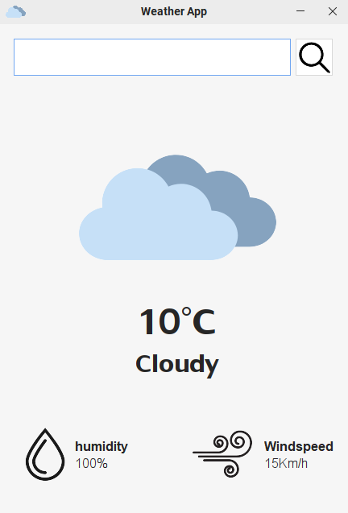

# Weather App

This Weather App is yet another generic app which Javascript developers make in their learning stage so the difference here is I use Java to make this app.


In the following project, I largely copied the code of @TapTap_196 on youtube. The purpose of this project is to learn how to call APIs and do so in Java.


## Screenshots



## Run Locally

### Requirements

- JDK 22 or above version

Clone the project

```bash
  git clone https://github.com/Spike271/WeatherApp.git
```

Go to the project directory

```bash
  cd src/main/java
```

Set the classpath

```bash
set classpath=../resources/json-simple-1.1.1.jar;.
```

Run the Main File

```bash
  java Main.java
```